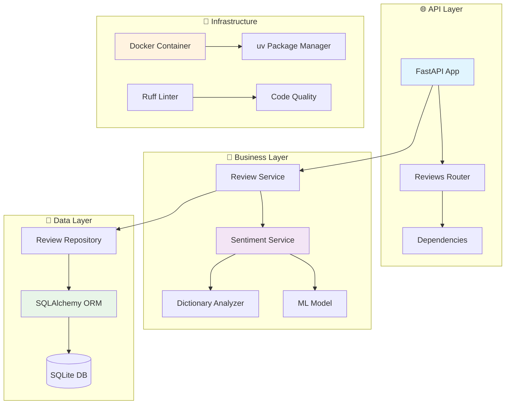
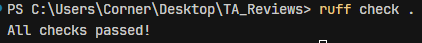

# 🎯 Reviews Sentiment Service

[](https://www.python.org/downloads/)
[](https://fastapi.tiangolo.com/)
[](https://www.docker.com/)
[](LICENSE)

Современный мини-сервис для анализа настроения отзывов пользователей в реальном времени. Сервис принимает отзывы через HTTP API, определяет их эмоциональную окраску (позитивная, негативная, нейтральная) с помощью ML и словарного подхода, и сохраняет в базе данных.

## 🚀 Особенности

- ⚡ **FastAPI** - высокопроизводительный веб-фреймворк с автоматической документацией
- 🤖 **Гибридный анализ** - ML модель (Naive Bayes + TF-IDF) с fallback на словарный подход
- 🐳 **Docker Ready** - полная контейнеризация с docker-compose
- 📊 **Детальная аналитика** - вероятности предсказаний и методы анализа
- 🔧 **Современный стек** - uv, ruff, pydantic, SQLAlchemy
- 📚 **Автодокументация** - Swagger UI и ReDoc из коробки

## 🏗️ Архитектура



## 🛠️ Технологический стек

| Компонент         | Технология | Версия | Назначение                                           |
| -------------------------- | -------------------- | ------------ | -------------------------------------------------------------- |
| **Web Framework**    | FastAPI              | 0.104.1      | REST API и автодокументация                   |
| **ML/AI**            | scikit-learn         | 1.3.2        | Naive Bayes классификатор                         |
| **ORM**              | SQLAlchemy           | 2.0.23       | Работа с базой данных                        |
| **Validation**       | Pydantic             | 2.5.0        | Валидация данных и настроек            |
| **Database**         | SQLite               | -            | Легковесная реляционная БД             |
| **Server**           | Uvicorn              | 0.24.0       | ASGI сервер                                              |
| **Package Manager**  | uv                   | latest       | Быстрое управление зависимостями |
| **Code Quality**     | Ruff                 | 0.12.0+      | Линтинг и форматирование                 |
| **Containerization** | Docker               | -            | Контейнеризация приложения            |

## 📦 Установка и запуск

### 🎯 Вариант 1: Docker (Рекомендуется)

Самый простой способ запуска:

```bash
# Клонирование репозитория
git clone <repository-url>
cd reviews-sentiment-service

# Запуск с Docker Compose
docker-compose up -d

# Проверка статуса
docker-compose logs -f
```

**Или с Makefile:**

```bash
make build  # Сборка образа
make run    # Запуск контейнера
make logs   # Просмотр логов
make stop   # Остановка
```

### ⚡ Вариант 2: uv (Современный подход)

```bash
# 1. Установка uv
# Windows (PowerShell)
irm https://astral.sh/uv/install.ps1 | iex

# macOS/Linux
curl -LsSf https://astral.sh/uv/install.sh | sh

# 2. Создание виртуального окружения
uv venv

# 3. Установка зависимостей
uv pip install -r requirements.txt

# 4. Настройка окружения
cp .env.example .env  # Linux/macOS
copy .env.example .env  # Windows

# 5. Запуск сервиса
# Windows
.venv\Scripts\activate && python -m uvicorn app.main:app --reload

# Linux/macOS
source .venv/bin/activate && python -m uvicorn app.main:app --reload
```

### 🐍 Вариант 3: Классический pip

```bash
# Создание виртуального окружения
python -m venv venv
source venv/bin/activate  # Linux/macOS
venv\Scripts\activate     # Windows

# Установка зависимостей
pip install -r requirements.txt

# Запуск
uvicorn app.main:app --reload
```

## 🌐 Доступ к сервису

После запуска сервис будет доступен по следующим адресам:

| Endpoint               | URL                          | Описание                                      |
| ---------------------- | ---------------------------- | ----------------------------------------------------- |
| **API**          | http://localhost:8000        | Основной API                                  |
| **Swagger UI**   | http://localhost:8000/docs   | Интерактивная документация   |
| **ReDoc**        | http://localhost:8000/redoc  | Альтернативная документация |
| **Health Check** | http://localhost:8000/health | Проверка состояния сервиса    |

## 📖 API Документация

### 🔍 Основные endpoints

| Method   | Endpoint                               | Описание                                  | Пример                                    |
| -------- | -------------------------------------- | ------------------------------------------------- | ----------------------------------------------- |
| `POST` | `/api/v1/reviews`                    | Создание отзыва с анализом | [Пример](#создание-отзыва)     |
| `GET`  | `/api/v1/reviews`                    | Получение всех отзывов        | [Пример](#получение-отзывов) |
| `GET`  | `/api/v1/reviews?sentiment=positive` | Фильтрация по настроению    | [Пример](#фильтрация)              |
| `POST` | `/api/v1/reviews/analyze`            | Анализ без сохранения          | [Пример](#детальный-анализ)   |
| `GET`  | `/health`                            | Проверка состояния               | [Пример](#health-check)                      |

### 📝 Примеры использования

#### Создание отзыва

```bash
curl -X POST "http://localhost:8000/api/v1/reviews" \
     -H "Content-Type: application/json" \
     -d '{"text": "Это отличный сервис, мне очень нравится!"}'
```

**Ответ:**

```json
{
  "id": 1,
  "text": "Это отличный сервис, мне очень нравится!",
  "sentiment": "positive",
  "created_at": "2025-07-25T10:30:45.123456"
}
```

#### Получение отзывов

```bash
# Все отзывы
curl -X GET "http://localhost:8000/api/v1/reviews"

# Только позитивные
curl -X GET "http://localhost:8000/api/v1/reviews?sentiment=positive"

# Только негативные
curl -X GET "http://localhost:8000/api/v1/reviews?sentiment=negative"

# Только нейтральные
curl -X GET "http://localhost:8000/api/v1/reviews?sentiment=neutral"
```

#### Детальный анализ

```bash
curl -X POST "http://localhost:8000/api/v1/reviews/analyze" \
     -H "Content-Type: application/json" \
     -d '{"text": "Превосходное качество обслуживания!"}'
```

**Ответ с ML подходом:**

```json
{
  "sentiment": "positive",
  "method": "machine_learning",
  "probabilities": {
    "positive": 0.85,
    "negative": 0.10,
    "neutral": 0.05
  }
}
```

**Ответ со словарным подходом:**

```json
{
  "sentiment": "positive",
  "method": "dictionary",
  "probabilities": null
}
```

#### Health Check

```bash
curl -X GET "http://localhost:8000/health"
```

**Ответ:**

```json
{
  "status": "healthy",
  "service": "Reviews Sentiment Service"
}
```

## 🧠 Алгоритм анализа настроения

Сервис поддерживает **гибридный подход** с двумя методами анализа:

### 🤖 1. Machine Learning подход (по умолчанию)

- **Алгоритм**: Naive Bayes классификатор с TF-IDF векторизацией
- **Обучающие данные**: 45 размеченных примеров (15 позитивных, 15 негативных, 15 нейтральных)
- **Особенности**:
  - Учитывает биграммы для понимания контекста
  - Автоматическое обучение при первом запуске
  - Сохранение модели в `app/ml/sentiment_model.joblib`
  - Возврат вероятностей предсказания

### 📚 2. Словарный подход (fallback)

- **Позитивные слова**: хорош, люблю, отлично, супер, замечательно, прекрасно, великолепно, нравится, классно
- **Негативные слова**: плохо, ненавиж, ужасно, отвратительно, кошмар, не нравится, плохой, худший, провал
- **Логика**: подсчет позитивных vs негативных слов с определением преобладающего настроения

### ⚙️ Настройка

Переключение между подходами через переменную окружения в `.env`:

```bash
USE_ML_SENTIMENT=true   # ML подход (по умолчанию)
USE_ML_SENTIMENT=false  # Словарный подход
```

## 📁 Структура проекта

```
reviews-sentiment-service/
├── 📁 app/                          # Основное приложение
│   ├── 🐍 __init__.py
│   ├── 🚀 main.py                   # FastAPI приложение
│   ├── ⚙️ config.py                 # Настройки и конфигурация
│   ├── 📁 api/                      # API слой
│   │   ├── 🔗 dependencies.py       # Зависимости FastAPI
│   │   └── 📁 v1/
│   │       └── 📝 reviews.py        # Роутеры для отзывов
│   ├── 📁 core/                     # Ядро приложения
│   │   ├── 💾 database.py           # Настройка базы данных
│   │   └── ❌ exceptions.py         # Кастомные исключения
│   ├── 📁 models/                   # Модели данных
│   │   ├── 🗄️ database.py          # SQLAlchemy модели
│   │   └── 📋 schemas.py            # Pydantic схемы
│   ├── 📁 services/                 # Бизнес-логика
│   │   ├── 📊 review_service.py     # Сервис отзывов
│   │   └── 🧠 sentiment_service.py  # Анализ настроения
│   ├── 📁 repositories/             # Слой данных
│   │   └── 🗃️ review_repository.py  # Репозиторий отзывов
│   ├── 📁 data/                     # Данные для ML
│   │   └── 📚 training_data.py      # Обучающие данные
│   └── 📁 ml/                       # ML модели
│       ├── 🤖 sentiment_model.py    # ML модель
│       └── 💾 sentiment_model.joblib # Сохраненная модель
├── 📁 scripts/                      # Скрипты запуска
│   ├── 🚀 start.py
│   ├── 🪟 start.bat
│   └── 🐧 start.sh
├── 🐳 Dockerfile                    # Docker конфигурация
├── 🐳 docker-compose.yml           # Docker Compose
├── 🛠️ Makefile                     # Команды для разработки
├── ⚙️ pyproject.toml               # Конфигурация проекта
├── 📦 requirements.txt             # Python зависимости
├── 🌍 .env                         # Переменные окружения
├── 📄 .env.example                 # Пример конфигурации
└── 📖 README.md                    # Документация
```

## 🔧 Конфигурация

### 🌍 Переменные окружения (.env)

```bash
# Database
DATABASE_URL=sqlite:///./reviews.db

# API
API_V1_PREFIX=/api/v1
PROJECT_NAME=Reviews Sentiment Service
VERSION=1.0.0

# Development
DEBUG=true

# ML Settings
USE_ML_SENTIMENT=true
```

### 📋 Настройки Ruff (pyproject.toml)

Проект использует современные стандарты качества кода:

```toml
[tool.ruff]
target-version = "py311"
line-length = 88

[tool.ruff.lint]
select = [
    "E",  # pycodestyle errors
    "W",  # pycodestyle warnings
    "F",  # pyflakes
    "I",  # isort
    "B",  # flake8-bugbear
    "C4", # flake8-comprehensions
    "UP", # pyupgrade
]
```

### ✅ Проверка качества кода

Для проверки соответствия стандартам качества выполните:

```bash
# Проверка линтером
ruff check app/

# Форматирование кода
ruff format app/
```

**Скриншот успешной проверки Ruff:**



Актуально на 25.07.2025

## 🐳 Docker

### 📋 Команды Docker

```bash
# Сборка образа
docker-compose build

# Запуск в фоне
docker-compose up -d

# Просмотр логов
docker-compose logs -f

# Остановка
docker-compose down

# Полная очистка
docker-compose down -v --rmi all
```

### 🔧 Makefile команды

```bash
make help   # Показать все доступные команды
make build  # Собрать Docker образ
make run    # Запустить контейнер
make stop   # Остановить контейнер
make clean  # Удалить контейнер и образ
make logs   # Показать логи
make shell  # Открыть shell в контейнере
```

## 🧪 Тестирование

### 🚀 Быстрая проверка

```bash
# Health check
curl http://localhost:8000/health

# Создание тестового отзыва
curl -X POST "http://localhost:8000/api/v1/reviews" \
     -H "Content-Type: application/json" \
     -d '{"text": "Отличный сервис!"}'

# Получение всех отзывов
curl http://localhost:8000/api/v1/reviews
```

### 📊 Примеры тестовых данных

| Текст отзыва                                        | Ожидаемый результат | Метод    |
| -------------------------------------------------------------- | ------------------------------------- | ------------- |
| "Отличный сервис, очень доволен!"    | positive                              | ML/Dictionary |
| "Ужасно работает, не рекомендую"     | negative                              | ML/Dictionary |
| "Обычный день, ничего особенного"   | neutral                               | ML/Dictionary |
| "Супер классно люблю этот продукт" | positive                              | Dictionary    |
| "Плохо сделано, полный провал"         | negative                              | Dictionary    |

## 🚀 Развертывание

### 🔧 Development

```bash
# С hot reload
uvicorn app.main:app --reload --host 0.0.0.0 --port 8000
```

### 🏭 Production

```bash
# Без reload, оптимизированный запуск
uvicorn app.main:app --host 0.0.0.0 --port 8000 --workers 4
```

### 🐳 Docker Production

```bash
# Запуск в production режиме
docker-compose up -d
```

## 🤝 Разработка

### 📋 Требования

- Python 3.11+
- uv или pip
- Docker (опционально)
- Git

### 🔄 Workflow

1. **Клонирование**: `git clone <repo>`
2. **Настройка окружения**: `uv venv && uv pip install -r requirements.txt`
3. **Конфигурация**: `cp .env.example .env`
4. **Запуск**: `uvicorn app.main:app --reload`
5. **Тестирование**: Проверка через http://localhost:8000/docs
6. **Линтинг**: `ruff check app/ && ruff format app/`

### 🎯 Добавление новых данных для ML

Для улучшения качества ML модели добавьте новые примеры в `app/data/training_data.py`:

```python
TRAINING_DATA = [
    # Добавьте ваши примеры
    ("Ваш новый отзыв", "positive"),  # или "negative", "neutral"
    # ... остальные данные
]
```

Затем перезапустите сервис для переобучения модели.

## 📈 Мониторинг и логирование

### 📊 Метрики

- **Health endpoint**: `/health` - состояние сервиса
- **ML модель**: Автоматическое логирование точности при обучении
- **API запросы**: Логирование всех HTTP запросов

### 📝 Логи

```bash
# Docker логи
docker-compose logs -f

# Локальные логи
tail -f logs/app.log  # если настроено
```
